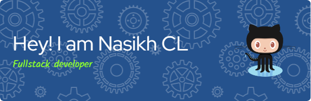

<!--    
?
  -->
  

  
  
  
  
  
    
    
[WEBSITE](https://nasikhcl.me)

<!-- <h1>
  hey,
   Nasikh CL Here
</h1> -->

  

<!-- 

  

 -->

### :man_technologist: About Me :
I am a Full Stack Frontend Developer  from India.
- :telescope: Working as Associate developer at iNeuron + PW Skills (Physics Wallah)
<!-- - :telescope: I Worked as a Teaching Assistant Intern At Coding Ninjas, Resolving Students Doubts and helping them in their projects and Other Assignments -->
- :mailbox:How to reach me: 
- ⚡ Fun fact: Im a Mechangical Engineer By degree

### :hammer_and_wrench: Languages and Tools :

 
  &nbsp;
  &nbsp;
  &nbsp;
  &nbsp;
  &nbsp;
  &nbsp;
   &nbsp;
   
  &nbsp;
  
  

  
  
          

 

  

  

 

<!--
**NasikhCL/nasikhcl** is a ✨ _special_ ✨ repository because its `README.md` (this file) appears on your GitHub profile.

Here are some ideas to get you started:

- 🔭 I’m currently working on ...
- 🌱 I’m currently learning ...
- 👯 I’m looking to collaborate on ...
- 🤔 I’m looking for help with ...
- 💬 Ask me about ...
- 📫 How to reach me: ...
- 😄 Pronouns: ...
- ⚡ Fun fact: ...
-->
